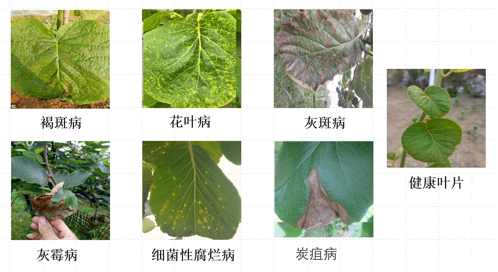
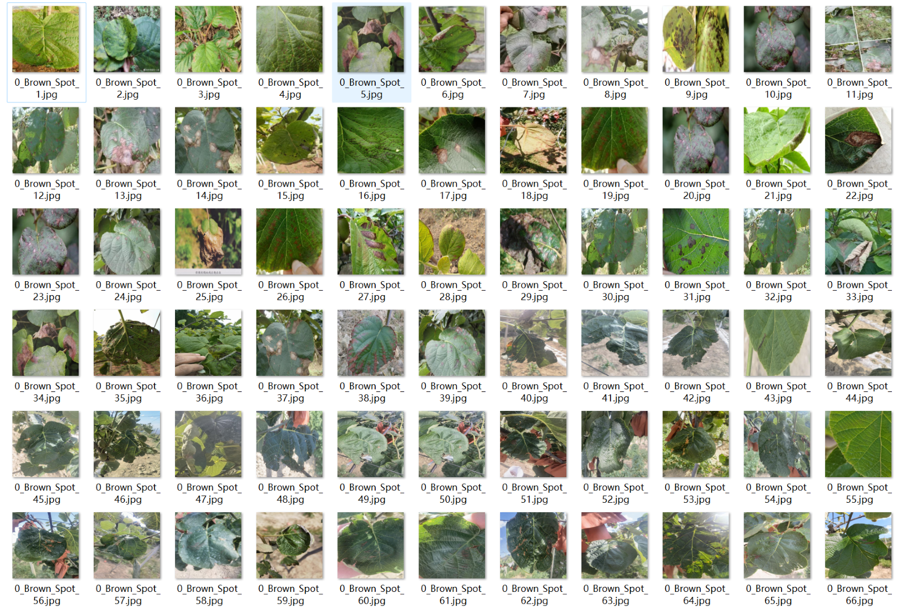
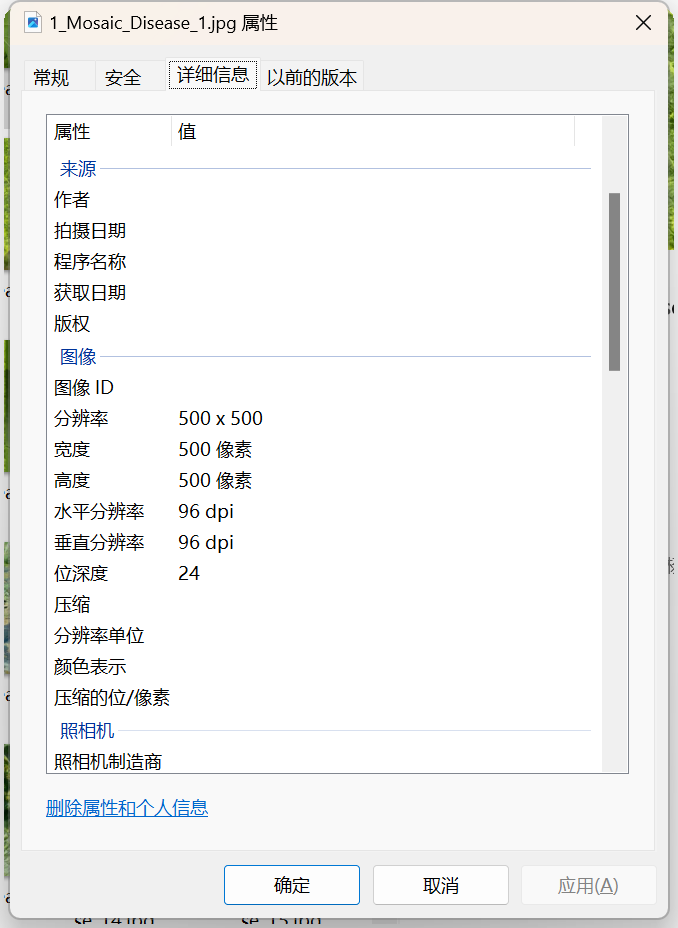
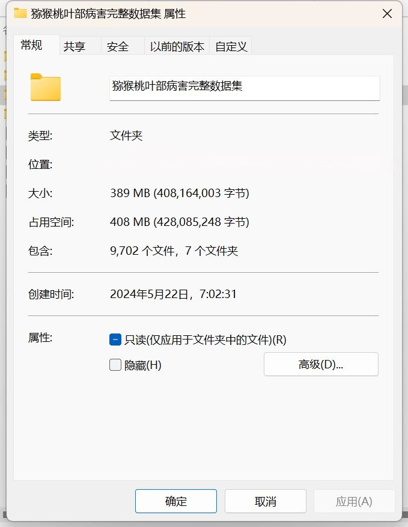

# Wisteria Leaf Disease Image Classification Dataset

Complete Dataset Introduction: Contains 1296 images in the folder "Healthy Leaves".
Folder with 1194 images of Glossy Blight.
Folder with 1176 images of Botrytis Blight.
Folder with 1326 images of Gray Mold.
Folder with 1212 images of bacterial decay.
Folder with 1176 images of Spider Blight.
Folder with 2322 images of Brown Spots.
Total number of images across all subfolders: 9702.

Examples of dataset images:
+
Image resolution
+
For any questions, please ask directly; I'm not on a Friendship Verification system, so you can send messages without needing my approval. I can see them.
Search me out, and send your questions at once; I'll reply to you. Sometimes I'm busy, so please describe your question and intention clearly when you contact me.
I will also reply to you when I have time, without any formalities, which makes it more efficient.
Phone numbers are the same as above. If I forget to reply or you're anxious, you can also text or call.

## Images

Here is a pay link on Stripe ( https://buy.stripe.com/3cs8yP7sY87d0vu9AB ). Please contact me lonlonago@foxmail.com after funding $89, and I will send you a complete data files , thank you!

